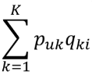

# Model-based Collaborative Filtering

This project implements model-based CF predicting user's movie ratings. We will train the model using "GroupLens Latest Dataset" which has about 27 million ratings, 58 thousands movies and 280 thousands users.


data source link : https://grouplens.org/datasets/movielens/


## Getting Started

The only thing we have to do before running this model is to install packages such as Numpy, Numba etc.


### Installing

```bash
# install all packages we need
pip3 install -r requirements.txt
```


## Running the tests


### Break down into end to end tests


## Description

> This section references [1]. If you want to know more detail information about this topic, please check the reference. Thank you :)

Model-based CF enables to train latent features of users and items from massive rating data and predict rating of items. It is one of the most successful prediction model for OTT(over-the-top) services such as Netflix and Watcha Play. It performs well for the large dataset but, it shows pool performance with a few ratings. This problem, low performance because of the lack of data, is called "Cold Start". However, this is not a scope of this docs. We won't tackle with this problem.


### How can we recommend movies to the user?

1. Define "Loss"
2. Define "Objective Function" based on 1
3. Train a model built with "Objective Function" using Gradient descent
4. Calculate prediction of rating using a movie row and a user row
5. Recommend Top-N movies by rating.


#### 1. Define Loss


"Loss" means the difference between real rating and predicted rating. Model-based CF assumes that rating is able to approximate multiplication of user vector and transpose of movie vector.

##### P : user vector / M : movie vector


R hat is the above equation, multiplication of user vector and transpose of movie vector. Final goal of this model is minimize the "Loss" through the training step.  


#### 2. Define "Objective Function" based on 1


#### 3. Train a model built with "Objective Function" using Stochastic Gradient Descent

```python
# Stochastic Gradient using numba to boost training speed
@njit
def stochastic_gradient(user_item, users, user_count, movies, learning_rate, regular_term):
    for user in prange(user_count):
        movie_length = user_item[user].shape[0]
        for idx in prange(movie_length):
            movie = int(user_item[user][idx][0])
            score = user_item[user][idx][1]            
            error = score - np.dot(movies[movie, :], np.transpose(users[user, :]))
            delta_movie = users[user, :] * error - movies[movie, :] * regular_term
            delta_user = movies[movie, :] * error - users[user, :] * regular_term
            movies[movie, :] = movies[movie, :] + delta_movie * learning_rate
            users[user, :] = users[user, :] + delta_user * learning_rate
```

The model-based CF uses SGD(Stochastic Gradient Descent) to optimize the model. SGD enables to train a model faster than a normal gradient descent. Especially for model-based CF, SGD performs well to train users and movies because of the data sparsity. The whole dataset is massive, but it is only about hundreds ratings for each user and movie. Numba is JIT compiler converting Python into machine code for speed up.


#### 4. Calculate prediction of rating using a movie row and a user row




The Item i rating of the user u is calculated by the above equation.

```python
# test.py
# predict a movie rating of a user
def predict(u, i):
    return np.dot(fm_users[userMapper[u], :], np.transpose(fm_movies[movieMapper[i], :]))
```


#### 5. Recommend Top-N movies by rating.

This step is quite simple compared with the others. Top-N movies are recommended by predicted rating. First, we should calculate predicted rating of the all unwatched movies of a user and sort movies by ratings in descending order. After that, we just recommend Top-N items from sorted movies.


## Authors

- Kwanwoong Yoon - Initial work


## License

This project is licensed under the MIT License - see the LICENSE file for details


## References

- [1] Chen, Rui, et al. "A survey of collaborative filtering-based recommender systems: From traditional methods to hybrid methods based on social networks." *IEEE Access* 6 (2018): 64301-64320.

